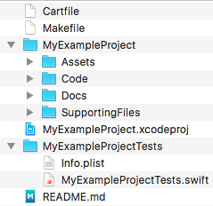

--------

# ⚠️ TODO

## Directory setup
1. `git clone ssh://git@git.allaboutapps.at:2222/aaaios/ios-project-template.git <my-example-project>`
2. Open Xcode -> Create a new Xcode Project
	* Name: `<MyExampleProject>`
	* Single View  
	[✔] Include Unit Tests
	* Navigate into `<my-example-project>`
	* **Create**
	* Close Xcode
3. Open `my-example-project` (git-repo root) in Finder
4. Drag
	* `<MyExampleProject>/AppDelegate.swift` to `MyProject/Code`
	* `<MyExampleProject>/Assets.xcassets` to `MyProject/Assets`
	* `<MyExampleProject>/Base.lproj` to `MyProject/Code/Storyboards`
	* `<MyExampleProject>/Info.plist` to `MyProject/SupportingFiles`
	* `<MyExampleProject>/ViewController.swift` to `MyProject/Code/ViewControllers`
	* `<MyExampleProject>.xcodeproj` to root
	* `<MyExampleProject>Tests` to root
5. Remove (the now empty) `<MyExampleProject>/<MyExampleProject>` and `<MyExampleProject>` directories
6. Rename `MyProject` to `<MyExampleProject>`

**Your folder should look like this:**  

## Xcode Project setup
1. Open the `<MyExampleProject>.xcodeproj` file
2. Remove all red entries under \<MyExampleProject>
3. Drag all directories under \<MyExampleProject> from Finder to Xcode under <MyExampleProject>
	* [✔] Copy Items if needed
	* [✔] Create groups
4. Remove references to `.gitkeep` Files (in Xcode) in every sub-directory of \<MyExampleProject>
5. Naviagte to the \<MyExampleProject> Target and click "Choose Info.plist File..." (at the top)
	* Choose `<MyExampleProject>/SuportingFiles/Info.plist`
6. In the App Icons section click "Use Asset Catalog" for App Icons Source
	* Use `Assets` Catalog
	* Don't migrate Launch Image
7. Choose AppIcon instead of AppIcon-2 from drop down
8. Navigate to Assets Catalog and remove AppIcon-2 (Xcode... 😫)  

## Further setup
* Run `make setup` to install all needed dependencies
* Run `make gitinit` to setup a new git repo in the project root folder (**WARNING:** removes any existing git repo in the project root folder)
* Update the `Makefile` with your project settings
* Update the `.swiftlint.yml` file to include the project root folder 
* Fill the README
* Delete this TODO section. (And enjoy your fresh and clean Project-setup 🙌)

--------

# Project Title

**Swift 2**

Project description in 1-5 sentences.

[Screenshots]

## Structure

TODO

## Documentation

Where do I find API docs, wireframes, etc.?

## Features

| Used | Property |
|------|----------|
| ✔    | Unit Tests
|      | Push Notifications 
| ✔    | Realm

## Tests

* Run `make test` to run tests locally.
* Run `make lint` to lint the project.
* Run `make push` to test push notifications.